- 👋 Hi, I’m Nicolas Schmidt <[@nsc-de](https://github.com/nsc-de/)>
- 👀 I'm interested in all kinds of projects, but I like building compilers
- 👨‍🎓 I'm a bachelor student at the [Technical University of Darmstadt](https://www.tu-darmstadt.de/index.en.jsp)
- 🔟 I've learned java at the age of ten, so im coding about a decade now
- 🌱 I've seen quite a lot of stuff, but I am always interested in something new
- 💞️ I'm maintaining a few open source projects written in different languages and environments
- 🍹 My biggest project is [shake](https://shakelang.com) ([@shakelang](https://github.com/shakelang)), an open-source object oriented, modern programming language
- 📫 Contact via [`contact@nscde.com`](mailto:contact@nscde.com) 📨
<!-- - 🇺🇦 Stand with Ukraine! 🕊️ -->

<!--
</img>

### My Organisations

<ul>
  <li>
    <a href="https://github.com/shakelang">
      
      shakelang
    </a>
    - An object-oriented programming language (see <a href="https://shakelang.com/">https://shakelang.com/</a>)
  </li>
  <li>
    <a href="https://github.com/screateam">
      
      SCREA
    </a>
  </li>
</ul>
-->

